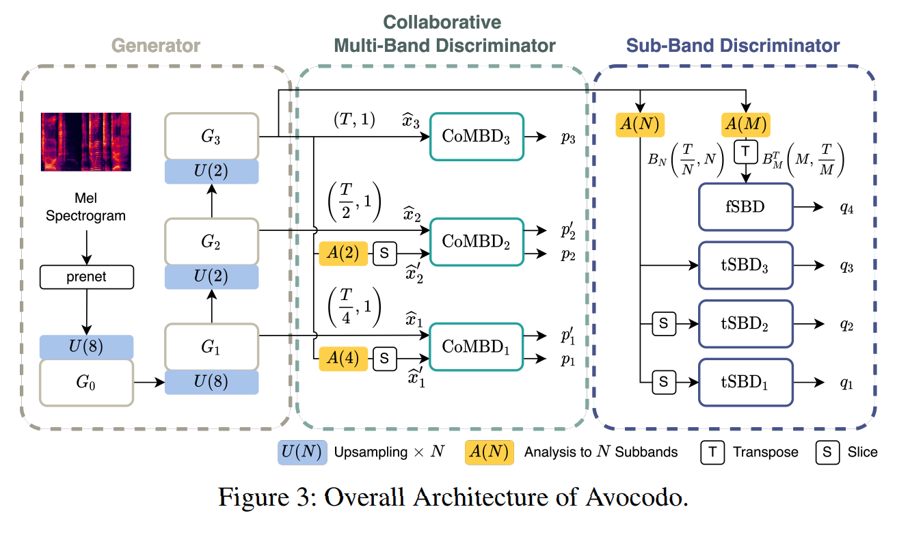

# Avocodo: Generative Adversarial Network for Artifact-free Vocoder

Unofficial implementation of [Avocodo: Generative Adversarial Network for Artifact-free Vocoder](https://arxiv.org/abs/2206.13404).


> **Disclaimer:** It only works on config_v1.json for now and this repo build with experimentation purpose not for Production.
- **For best quality speech synthesis please visit [deepsync.co](https://deepsync.co/)**
## Training:
```
python train.py --config config_v1.json
```


## Notes:
* Avocodo uses same Generator as HiFi-GAN V1 and V2 but using different discriminators for modelling better lower and higher frequencies.
* PQMF is the crucial for both Discriminators.
* Losses are similar to HiFi-GAN.
* Performance and speed both are some what similar to HiFi-GAN.
* Avocodo far better than HiFi-GAN when it comes to synthesize unseen speaker.
* **Avocodo training is around 20 % faster than HiFi-GAN also it took very less training to output excellent quality of audio.**


## Citations:
```
@misc{https://doi.org/10.48550/arxiv.2206.13404,
  doi = {10.48550/ARXIV.2206.13404},
  
  url = {https://arxiv.org/abs/2206.13404},
  
  author = {Bak, Taejun and Lee, Junmo and Bae, Hanbin and Yang, Jinhyeok and Bae, Jae-Sung and Joo, Young-Sun},
  
  keywords = {Audio and Speech Processing (eess.AS), Artificial Intelligence (cs.AI), Sound (cs.SD), FOS: Electrical engineering, electronic engineering, information engineering, FOS: Electrical engineering, electronic engineering, information engineering, FOS: Computer and information sciences, FOS: Computer and information sciences},
  
  title = {Avocodo: Generative Adversarial Network for Artifact-free Vocoder},
  
  publisher = {arXiv},
  
  year = {2022},
  
  copyright = {arXiv.org perpetual, non-exclusive license}
}
```

